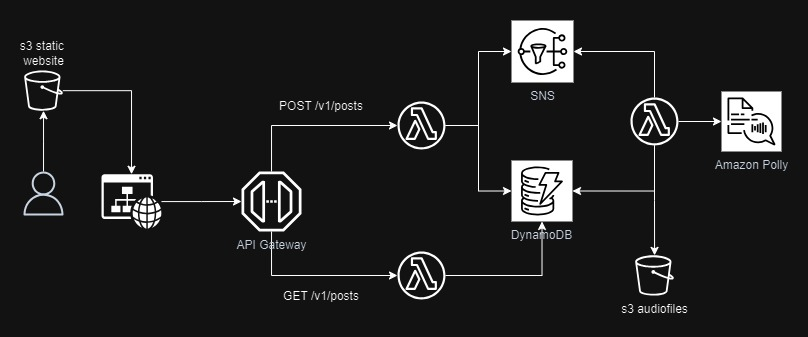

# AWS Polly Post - Listen To Your Posts

A serverless web application to convert written posts into audio files.

The application is composed of a React frontend and a serverless backend. The infrastructure is deployed on AWS utilizing a wide array of AWS services, and is provisioned through Terraform.

## Architecture



### Key Components

1. **S3 Static Website**: Hosts the frontend, a static website built with React.

2. **API Gateway**: Acts as a bridge between the frontend and backend, exposing HTTP endpoints for interacting with the application.

   It handles two main endpoints:

   - `POST /v1/posts`: Submits a new post to be converted to audio.
   - `GET /v1/posts`: Retrieves the list of posts, their statuses and the URL to the audiofile

3. **AWS Lambda**:

   - The `POST` Lambda function handles incoming posts from the API Gateway. It processes each post, assigns a unique `record_id`, and stores it in DynamoDB. Additionally, it sends a message to SNS to trigger further processing.
   - The `convert_to_audio` Lambda function listens for SNS messages and initiates the audio conversion process using Amazon Polly. After the post is converted to audio, the resulting file is stored in an S3 bucket, and the corresponding entry in DynamoDB is updated to reflect the audio file’s availability.
   - The `GET` Lambda function retrieves post entries from DynamoDB and sends them back to the frontend.

4. **SNS (Simple Notification Service)**: Acts as an intermediary that broadcasts events, like when a new post is submitted, allowing other components (like Amazon Polly Lambda) to be notified.

5. **Amazon Polly**: Converts the text of the posts into audio files. The converted audio is stored or made accessible for the user to listen to.

6. **DynamoDB**: A NoSQL database that stores the posts and their metadata, including status, timestamps, and links to the generated audio files.

## Getting Started

### Prerequisites

- [AWS CLI](https://aws.amazon.com/cli/) installed and configured.
- [Terraform](https://www.terraform.io/) installed.

## Deployment

The infrastructure can be provisioned using Terraform. Ensure your AWS credentials are set up, then run the following commands:

1. Initialize Terraform:
   ```bash
   terraform init
   ```
2. Plan and apply the infrastructure:
   ```bash
   terraform apply
   ```
3. Build and Push the frontend
   ```bash
   make frontend-build
   make frontend-push
   ```

## What could be improved

- _Async Processing_:

  Use websockets or an asynchronous processing system to notify the frontend when audio generation is complete, improving user experience.

- _CDN Integration_:

  Use a Content Delivery Network (CDN) such as Amazon CloudFront to serve the frontend for reduced latency and improved load times.

- _User Management_:

  Integrate Amazon Cognito with API Gateway to manage user authentication and authorization, adding security to user actions.

- _Enhanced CORS Configuration_:

  Improve CORS security to restrict access to only the frontend domain, enhancing security against cross-origin requests.

## License

This project ist licensed under the Apache License, Version 2.0
